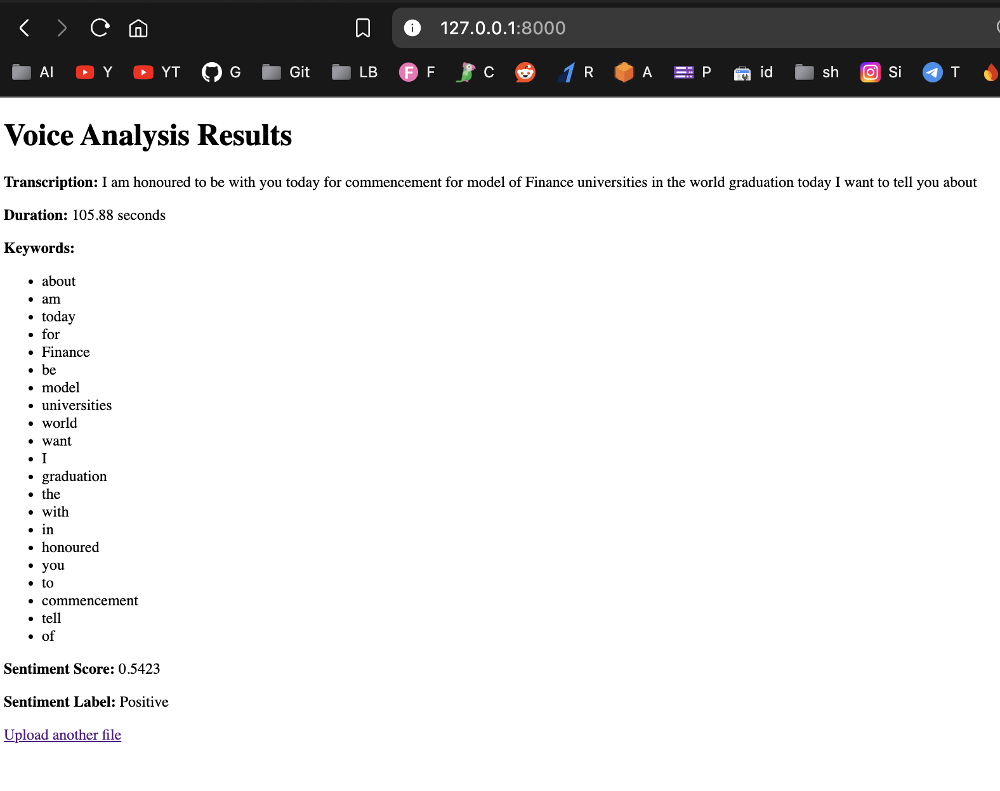
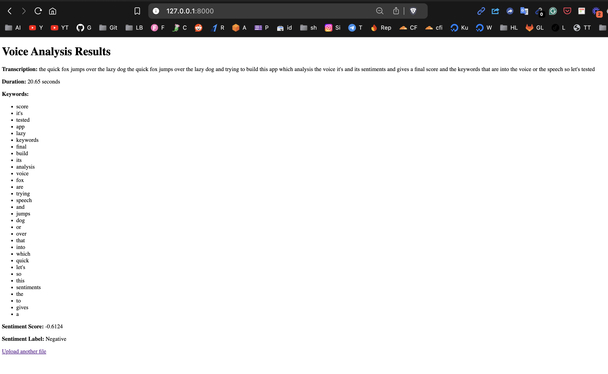

# voice_analytics:

Your Audio's Personal Therapist

## Description

Ever wished your audio files could spill their secrets?  Well, now they can!  voice_analytics is a Django project that's like a therapist for your audio files.  It's got all the tools to analyze your audio, from deciphering the words to understanding the emotions behind them.

Think of it as a digital shrink for your audio files.  It's got a keen ear for detail, a knack for understanding the nuances of human speech, and a whole lot of AI-powered magic.

## Features

* **Transcription:**  Turns your audio into text, so you don't have to listen to it again (unless you really want to).
* **Sentiment Analysis:**  Determines if your audio is happy, sad, angry, or just plain confused.  (It's like a mood ring for your audio files.)
* **Speaker Diarization:**  Identifies who's talking and when, so you can finally figure out who's responsible for that awkward silence.
* **Emotion Detection:**  Analyzes the audio for emotional cues, so you can understand the hidden feelings behind the words.  (It's like a lie detector for your audio files.)

## How it Works

1. **Upload your audio file:**  Just drag and drop your audio file into the app.  It's that easy.
2. **Let the AI do its thing:**  The app uses a combination of AI models to analyze your audio.  It's like a team of digital detectives working on your case.
3. **Get your results:**  The app will provide you with a detailed analysis of your audio, including the transcription, sentiment, speaker segments, and emotion features.

## Why You Need This

* **You're a podcast host:**  Find out what your listeners are really thinking about your show.
* **You're a teacher:**  Analyze your students' presentations to see if they're engaged and understanding the material.
* **You're a marketer:**  Understand how your customers are reacting to your ads.
* **You're just curious:**  Because why not?  It's fun!

## Installation

1. **Clone the repository:**

```
git clone https://github.com/sachnaror/voice_analytics.git

```

2. **Install the dependencies:**

```
pip install -r requirements.txt

```

3. **Run the server:**

```
python manage.py runserver

```

## Disclaimer

This app is not a substitute for professional therapy.  If you're feeling overwhelmed, please reach out to a qualified mental health professional.  But if you just need to understand your audio files better, this app is for you!

```
voice_analytics/
├── analytics/
│   ├── migrations/
│   ├── templates/
│   │   └── analytics/
│   │       ├── result.html
│   │       └── upload.html
│   ├── __init__.py
│   ├── admin.py
│   ├── apps.py
│   ├── forms.py
│   ├── models.py
│   ├── urls.py
│   ├── utils.py  # AI logic here
│   └── views.py  # Views handle the upload and result
├── media/
│   └── audio/  # Uploaded audio files
├── templates/
├── voice_analytics/
│   ├── __init__.py
│   ├── asgi.py
│   ├── settings.py
│   ├── urls.py
│   └── wsgi.py
└── manage.py

```


{ width="600" height="600" }

{ width="600" height="600" }
